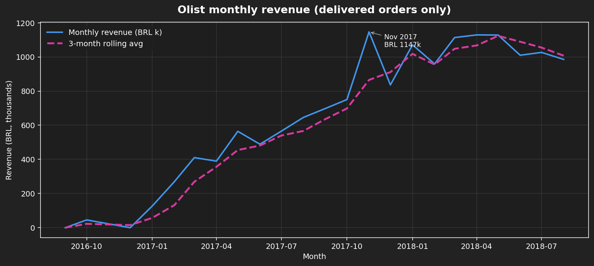
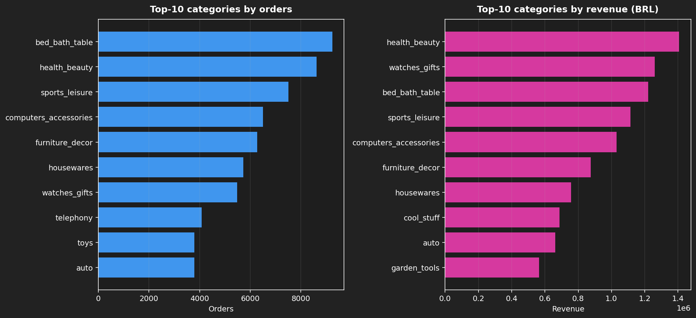
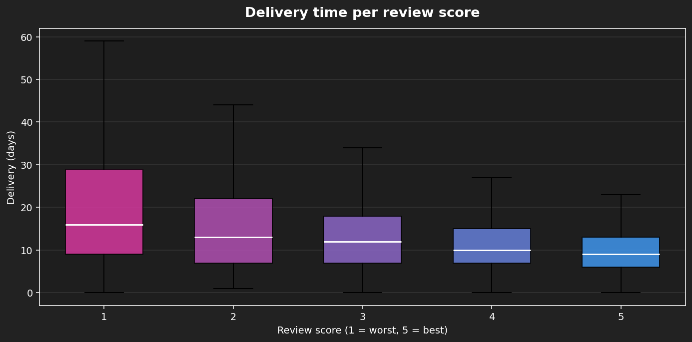

# Olist Brazilian E-commerce — EDA

Exploratory analysis of **100k+ orders** from the [Olist dataset](https://www.kaggle.com/datasets/olistbr/brazilian-ecommerce), exploring revenue trends, category mix, geography, delivery performance, and customer repeat behavior.

## Stack

`pandas` · `numpy` · `matplotlib` · `seaborn` · `scipy` · `jupyterlab`

## Highlights

| | |
|---|---|
| **Revenue** | 5.4× growth in 11 months; Black Friday 2017 = BRL 1.2M month |
| **Categories** | PCs + agro = top-revenue only (premium); garden tools = top-volume only |
| **Geography** | Top-5 states drive **75%** of orders and 76% of revenue |
| **Delivery → Review** | Spearman **−0.31**; 26+ days → 1.8★ drop in average review |
| **Retention** | **96.9%** of customers buy once and never return |







## Run it

```bash
git clone https://github.com/SyrineLarbi/ecommerce-eda
cd ecommerce-eda
python3 -m venv .venv && source .venv/bin/activate
pip install -r requirements.txt

# Get the dataset (Kaggle CLI configured)
kaggle datasets download -d olistbr/brazilian-ecommerce -p data/raw
unzip data/raw/brazilian-ecommerce.zip -d data/raw

jupyter lab notebooks/01-olist-eda.ipynb